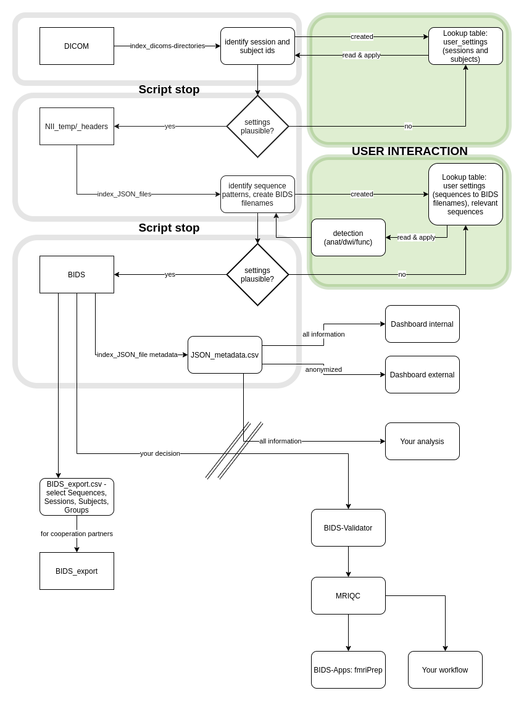

# BiDirect_BIDS_Converter

This tool is a project of my PhD. I developed this tool on all the neuroimaging data of the BiDirect study (Institute of Epidemiology and Social Medicine, Wilhelms-University, Münster, Germany). 

Here you find the generalizable version for your own datasets (on Philips tested), the release will be in around 2 weeks from now (first week of February 2020).

[](https://zenodo.org/badge/latestdoi/195199025)


# How-to-use:
- requirement: R installed on your system (tested on Ubuntu 18.04 and Windows 10)
- data in folder structure: __study_root/dicom/session/subject/dicom_folders_and_data__
- download the testing branch version (merged soon)
- unzip
- start a terminal and enter
- __Linux/Mac__  

> Rscript --vanilla path_to_cloned_repository/start_BIDS_ConverteR.R path_to_your_dicom_data/study_root  

- __Windows__  

> Rscript --vanilla C:\\path_to_cloned_repository\\start_BIDS_ConverteR.R C:\\path_to_your_dicom_data\\study_root  

- _vanilla_ sets R to ignore userfiles

_Example of my data structure_  

> Rscript --vanilla /home/niklas/start_BIDS-ConverteR.R /home/niklas/BiDirect_study_data    

# General workflow




# General folder structure (will be created - you only need the DICOM Folder!)


```bash
├── BIDS - output folder of your data to BIDS standard
│   ├── export
│   └── sourcedata
├── BIDS_anonymized (in work) - anonymizing structural images using pydeface or fsl_deface
│   └── sourcedata
├── BIDS_export (in work) - select sequences, sessions and subjects/groups, you want to export.
│   │      These will be copied here.
│   └── sourcedata
├── BIDS_template (these are templates you have to edit and move into the sourcedata/ 
│   │     directories)
│   ├── CHANGES
│   ├── dataset_description.json
│   └── README
├── Dashboards (containing a lot of information)
│   ├── internal_dash (containing age, weight, original subject id)
│   └── public_dash (only BIDS information)
├── DICOM (you only need this folder, all others will be created)
│   ├── Baseline
│   │   ├── 10002_your_study
│   │   ├── 10003_your_stdy
│   │   └── 10004_yr_study
│   ├── FollowUp
│   │   ├── 10003_your_study
│   │   ├── 10004_my_Study
│   │   └── 10005_your_study
├── json_files.csv
├── NII_headers <- non-anonymized DICOM headers (containing subject-id, gender, weight,        
│   │      acquisition date) - only JSON
│   ├── s0
│   └── s2
├── NII_temp <- anonymized DICOM headers written to JSON + NII temporary folder
│   ├── s0
│   └── s2
├── user_information
│   ├── 1_dcm2niix_paths.csv - file for qc of path renaming DICOM2NIIX step (your subject- and 
│   │         session-id to BIDS-subject- and BIDS-session-id)
│   └── 2_sequence2BIDS_renaming.csv - file for qc of sequence renaming from /NII_temp to /BIDS
└── user_settings
    ├── example_session.csv - template file
    ├── example_study_info.csv - template file
    ├── sequence_info.csv - Codebook for sequences (identified by file output name of dcm2niix  
    │       conversion, '3Dmprage' to 'T1w', please read the BIDS specification)
    ├── session_info.csv - Codebook for session (identified by input folder name 'Baseline',    
    │       'FollowUp', map your output (eg. 0 and 1)
    └── study_info.csv - Codebook for general study information, regex for subjects             
    ([:digit:]{5} in our case), patterns to remove ('_your_study|_yr_stdy|_my_Study') and       
    group id regex ([:digit:]{1}(<=?[:digit:]{4}))
```


The next update is coming! We implemented a Dashboard, which shows information about the whole study, acquired data, detail information on sequences, header information and plausility checks (id, gender, scanner sequence settings, duplicate sequences.

Furthermore, a Docker version is on its way, which is planned to be easy to use and with the possibility to use in an ongoing study.

## to do (needs implementation)  
- __optional__ "anonymization.csv"  
  - for changing subject ids - left(old name), right (new name)  
- anonymization using pydeface or fsl_deface for sharing anonymized (header + image) files. 
- diagnostic output: Markdown tables for Github/Gitlab
- consistent debugging information
- testing Siemens/GE dcm2niix conversion


## This script sorts the DICOM data of the BiDirect study into BIDS file format using following libraries:

Docker (which implements dcm2niix, debian, and the needed R libraries)

Dicom-to-NifTi conversion
- wrapper for Chris Rordens DCM2NII
  - working on Philips DICOMS
- using system() command

File renaming  
- stringr (for the renaming stuff and regular expressions)  
File management
- Tidyverse (dplyr, tidyr, stringr)


## The algorithm works as described below:

### Requirements

- a study folder as root directory
 - a folder named DICOM, with a folder for each session (your session IDs: eg. Baseline, FollowUp1, etc) 
  - in these folders the subjects of that session, containing the DICOM folders
  - you have to think about your subject nomenclature - if you have a naming scheme (e.g. 5 digits, the first on coding the group), other naming conventions are set by regular expressions later
  
### Container start

- The container is started using the command "docker run - ..... " (coming). 
Here your study folder (containing the DICOM folder) is mounted into the container and Docker can write files to it.

### Output folders and user interaction folders

- folder creation:
  - __BIDS/sourcedata__ - the output folder for your dataset in BIDS format
    - _dont.txt_ - change to _do.txt_ AFTER checking with the __Dashboard__ and __user diagnostics__ that your settings are working.
  - __NII_temp__ - write out folder for the anonymized dcm2niix converted files and headers. Do NOT delete these files. Each session is a folder, containing all subjects folders. Take care, it is dependent on the right subject nomenclature in the _user_settings/pattern_remove.txt_). The files are not in BIDS format but converted to NIIGZ.
  - __NII_headers__ - write out folder only for dicom headers (same structure as NII_temp), but these headers are NOT anonymized. It is used for plausibility checks (ID, gender, birthdate, weight, acquisition date).
  - __Export_Cooperation__
    - _export_template_ file, change the information and rename the file to enable BIDS export for a cooperation partner. _Export_output_BIDS_ folder is saved here.
  - __user_information__ - write out folder for information files regarding the renaming and conversion procedures
  - __user_diagnostics__ - write out folder for diagnostics
  - __user_settings__ - write out folder for the files, that you have to edit manually in a spreadsheet. All these files will be checked for not assigned values and inconsistencies, so that the code inhibits the further processing steps.  If you have e.g. subjects, that does not fit into your subject regex the code aborts - this is functionality to keep your output data clean and affects all "user_settings" files. Debugging messages will be implemented!
    - _pattern_remove.txt_ - is created before the dcm2niix conversion runs. Script aborts here, if the information below is not overwritten.
      - subjects: [:digit:]{5} - regular expression indicating 5 digits for the subject name. Find out how your naming convention for the subjects is. If you have subjects-ids like AB01 you can set this regex: [:alpha:]{2}[:digit:]{2}. For other setups look into the "stringr Cheat Sheet", page 2 - hostet by RStudio.
      - group: regex, where the group id in the filename is. In my case I can extract the first digit from the 5 digit subject id using [:digit:]{1}(?=[:digit:]{4}) - translated to "extract the one digit, which is followed by 4 other digits. Please think about adding it to the filename, because further file selection is much easier.
      - remove: Here you can add regex or absolute tags, that you want to remove from the foldername, e.g. ",BiDirect" in my case to have a clearly structured subject id.
      - This file is checked every run, to identify the already processed output folders, but also to keep sure, that your nomenclature works.
    - _BIDS_session_mapping.csv_ - 
      - Here you give your sessions a renaming nomenclature if needed (Baseline = 1, FollowUp = 2, or something else). 
      - This file is checked every run to identify new sessions.
    - _BIDS_mapping.csv_ - This is the file, that needs the most work. You map each of the automatically identified sequences in your dataset to a BIDS Standard name (T1w, T2w, FLAIR, ect...). Do NOT add filename extensions (eg.".nii" or ".nii.gz"). They will be added automatically to add NII and JSON data to your BIDS dataset (requirement of BIDS). The right nomenclature also identifies the bids tags _anat/dwi/func_ based on your input data. If the detection is misleading just contact me!
    Then you can label binary in the "relevant" column, which files are relevant (1) and not relevant (0) for you. This affects, which output you want to copy to the BIDS folder! Please check the diagnostics folder, if your mapping is correct. Here you can uncheck for instance Smartbrains or scanner-derived processings.
  - __Dashboard__ contains the rendered Dashboard if enabled, based on the extracted JSON information. Change _dont.txt_ to _do.txt_ if you want to enable the Dashboard. Only possible after the editing the _BIDS_mapping.csv_. 

You see, that you only have to ineract with 3 scripts! If something is implausible, the tool will give you in future the exact filename, where something is missing. 


### Functions

__Folder indexing__ reads the input foldernames of the subjects.

__First stop__: Writes outputs to the _user_settings/pattern_remove.txt_ and the _user_settings/BIDS_session_mapping.csv_ which you have do edit, before the next step runs. When edited restart the container!

__Dcm2niix__ by Chris Rorden is used to output all anonymized NIIGZ subject sequences into the __NII_temp__ folder, also outputting another set of not anonymized JSON headers to the __NII_header__ folder. Time amount is the same as in manual processing.


__JSON header name indexing__ finds all NOT ANONYMIZED json files from the _NII_headers_ folder. Takes care, that all information in each header is contained. It only extracts the attribute names of the sequence, to build a dataframe that can contain every attribute later on. If you encounter an error, I need information on the used header. Takes about 5-10 minutes when you have lot of files (90,000 in BiDirect).

__JSON attribute extraction__ uses the general attribute name structure derived by the __JSON header name indexing__ to join all attributes into the structure. Errors here indicate a list item in the json header, where the function is not able to join it into the dataframe structure. Takes about 10-15 minutes when you have a lot of files (90,000 in BiDirect).
 
#### Your data is now converted and the header information extracted. Now you need to enter further information to map input sequence to BIDS sequence.

__Second stop__: Writes outputs of the identified unique sequence names to _user_settings/BIDS_mapping.csv_. Now you have to set an BIDS filename to each sequence id and have to decide, which sequences you want to keep. If all information is set start the container again and decide, which functionality you would like to enable.

If you entered the required information, you have different options for the next run, because all information is set and all your data is processed.

__Dashboard Creation__ is a crucial step, to understand your data and check for implausibilities

__Copy2Bids__ copies your relevant sequences and the JSON headers to the BIDS standard, please check, if the anat/dwi/func detection worked out, using the Dashboard. I am working on adding the BIDS-required JSON files containing study and sequence information, so that you can pass the BIDS-Validator.

Interaction: To enable __Copy2Bids__ change the _dont.txt_ to the filename _do.txt_. I know, that it is not the best way to interact with a script, but I am now 2 weeks into Docker.

__Export2Cooperation__ copies your selected sequences, subjects, groups, sessions to __Export__ folder for sharing with collaborators. 

Interaction: Change the _export_template.txt_ to the needed export functionality - giving a study_name, select the groups (eg. 1|2 translates to 1 & 2, but not 3) and the session (0|1 translates to 0 & 1, but not to 2), the same counts for the sequence (T1w|task-rest_bold exports only T1w and task-rest_bold sequences). 

## General information

- I provided template files, that you have to edit. I think, that this makes the use more easy for you.
- Everytime you start the Container all the above steps run. If you have new subjects added to the __DICOM__ folder, you maybe need to edit the new information in the _.csv files_ or the __user_settings__ folder again. The older information from before is kept. If you delete the files, you need to set them up again, to get the process running.
- The implemented stops are only conducted, when manual editing is needed and a debug message is shown. E.g. a new subject, session or sequence was identified. 
- We implemented lazy processing, so that already converted files or extracted information is NOT extracted twice to enable functionality from the beginning of a study to the end.
- If something strange happens, delete every other folder than the DICOM folder and run the script again.

## Known issues

- Mainly based on misleading information provided by the user on the BIDS standard
- Based on scanner properties in the JSON header - list items in it lead to problems in the joining of all information


### Old Readme - will be removed soon

- __dcm_converter.Rmd__  
  - it indices a _dicom_ root folder with subfolders _(dicoms/survey/participant)_  
    - based on DCM2NII  
    - anonymized output of compressed .nii.gz and a json file containing the nii header information  
  - the structure will be kept identical  
    - _(nii_temp/survey/participant)_  
  - output: but changing the root folder to _/nii_temp_  
- __json_indexing.Rmd__
  - here the algorithm looks for _.json_ files in the subfolders of the _/nii_temp_ folder
  - these are opened and appended (if they don't exist) into an _.csv_ file
  - take care, different sequences have different physical properties, so simple appending is not possible
  - here you have to select manually, which information of the variables you want to keep, and which to ignore
    - depends on scanner, sequence type, settings
- __json_wrangling.Rmd__
  - here the sequence names get cleaned and are brought to the BIDS standard format
- __/reports/plausible_sequences.Rmd__
  
- In a first step the converted nii images will be simply converted into the BIDS file structure in the _nii_temp_ folder. But the nii images are not in the standard nomenclature.

In a second step the _nii_ files in the _nii_temp_ folder will be moved and renamed to the final _nii_ folder.


## Prerequisites

_Computer_:
- R and RStudio
- actual versions of packages (this results in error messages in the beginning)
- Windows or Linux machine (both tested)

_Data_:
- to start: a path to a folder (working directory)
- this folder needs following substructure: 
  - working_directory/dicom/Baseline/Bidirect,00001
  - working_directory/dicom/Baseline/Bidirect,00002
  - working_directory/dicom/FollowUp/Bidirect,00001
  - ~/dicom/session_01/studyname,sub_id
- a dicom folder
  - containing the session folders
    - containing the dicom folders of each participant

## How to use it?

- the dicoms of your subjects need to be in one folder per timepoint!  
  


USING THE SCRIPTS

- synchronize the data of the external drive into the "Bidirect_Dicom/dicom" folder
- open the "scripts/dcm_converter.Rmd" script and run it step by step
  - common issues - working directory not set in the markdown document, then the files for conversion are not found
  - this script indices all subject folders in the dicom structure and compares them with a text document "dcm_converted.txt"
  - the subjects that are not mentioned in the "dcm_converted" are converted and appended at the document
- open the "scripts/json_indexing.Rmd" for indexing of the new json files containing sequence metainformationen and append it to the already scanned jsons
- open the "scripts/json_wrangling_2.Rmd" for cleaning and structuring of the filenames, run it step-by-step

- "reports/plausible implausibe" contain reports that use the outputted df of "json_wrangling_2" and shows you the actual data situation  


- move_files.Rmd 
  - moves plausible files to nii_BIDS
    - including duplicate sequences (these contain an "_a.nii")
  - copies duplicates to another folder for manual selection
  - moves
    - Smartbrains
    - Clinical scanner preprocessed sequences
    - Strange sequences


#### longitudinal codebook

Baseline -> s0 
FollowUp1 -> s2
FollowUp2 -> s4
FollowUp2_Plus -> s4_plus  
FollowUp3 -> s6 
FollowUp3_Plus -> ses6_plus  

#### standard nomenclature 

__anat__:  
_T1w_  
_T2w_  
_T2_star_  
_T2_flair_  

__func__:  
_rest72/133_  
_epi_emo_faces_ (only at baseline) 

__dwi__:  
_DTI_  

__plus__ (only at ses3 and ses4, additional high resolution scans for 200 subjects):  
_T1w_mod_  
_T2w_mod_  
_T2_star_mod_  
_T2_flair_VISTA_  


You need a dictionary for renaming your sequence names to the _standard nomenclature_.


